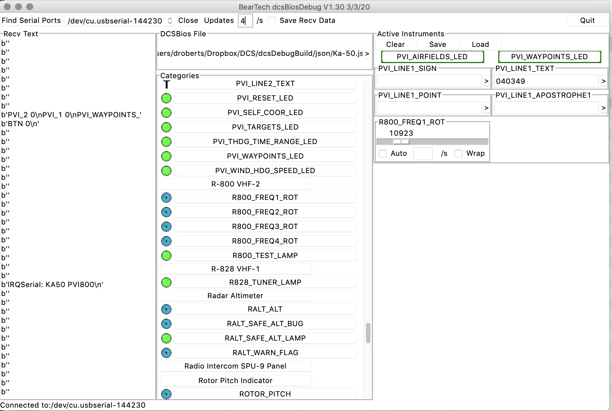
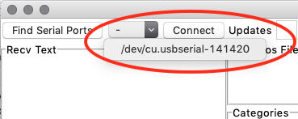

# dcsBiosDebug
App to help debug DCSBios instruments

Note
This is still a work in progress. Bugs are expected

#1 Downloads

Usage

Select Serial Port
Click 'Find Serial Ports', then choose from drop down list

Next click 'Connect'

Serial Port should then open. dcsBiosDebug will start sending updates to connected Arduinos, and print any responses to the RecvText window

By default, dcsBiosDebug will send one update per second. This can be increased by setting the value in the update/s field.
(max 30)
Note There's currently no error checking on this field. Entering something other than an integer value will cause an error inhte app. You'll need to restart.

#1Choose JSON File
Next, need to choose DCS Bios JSON file that defines instruments, buttons etc 

Click '>', browse to JSON fil for your aircraft in DCS Bios folder and click 'Open'

Categories area should get populated with all the various gugyes, LEDs etc defined for your aircraft

Make the required controls active
Now need to make active the controls you want debug in this session

Scroll down to the particular instrument, and click on hte entry for the LED, guage or text field to debug. This will add it to the Active Indicator area. 

Eg In this screen shot, controls for the Ka50 PVI-800 are being debugged. The PVI_WAYPOINTS_LED has been added

Add other indicators as required. Clicking 'Clear' will remove all indicators

Clicking on hte LED will toggle its state

Text Fields, click to make active. Enter the text to send, then click the '>' button to send

Int Fields
Again, click to make active. Drag slider to send update value to instrument.

Int Fields can also send updates automatically. Click the 'Auto' button

Int Field will then increment at set rate slider value, '/s' times per second,  until 65536 reached, then start decrementing until zero. Then repeat. 

If 'Wrap' is set, in Auto mode will wrap from 65536 to zero and continue incrementing until reaching 65536 the second time. Then will start decrementing, again wrapping from 0 to 65536. At end of second cycle will repeat.

Note. Int Field hasn't been fully verified. Regard this part of App as alpha quality.

Limitations
Field entry value checking as noted above
Int Field not fully verified

Further Work
Remove above limitations :-)
Save Active Indicator to a file
Remove individual indicators

