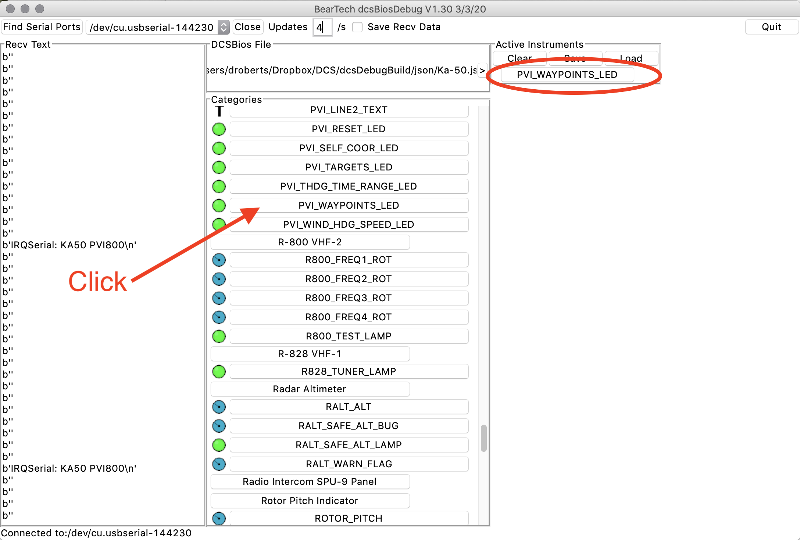

 # dcsBiosDebug  
 
App to help debug DCSBios instruments.

Note
This is still a work in progress. Bugs are expected.

# Concept

Often when building/debugging dcsBios based instruments, it can be useful to be able to send to the instrument a particular update message, gauge value etc without having start DCS, start a mission, try to fly whilst debugging etc
This app is designed to just that. It's a small GUI that allows you to send instrument state updates over a serial port to your cockpit hardware and view their responses.

# Updates
**v1.3.3**

Fixed single byte text field

**v1.3.2**

Fixed LED behaviour

**v1.3** 

Added Save/Load User settings

Saves settings on close

Added checking of fields

Testing of IntegerBuffer

Misc bugs fixed

# Downloads

v1.3.3

### Pre Built Binaries

[**Windows 64bit (1.3.2)**](https://github.com/tldBear/tldBear.github.io/blob/master/Downloads/dcsBiosDebug.exe)

Should be fully self contained. 
 
### Python script

[**Mac OSX App Bundle**](https://github.com/tldBear/dcsBiosDebug/releases/download/v1.3.3/MacOSX_dcsBiosDebug.app.zip)

[**Source**](https://github.com/tldBear/dcsBiosDebug/releases/tag/v1.3.3)

**Note** These are not fully self contained. Python3, as well as some dependancies (eg tkinter, pyserial & numpy) will need to be installed separately.

# Usage

## Select and Connect Serial Port
Click 'Find Serial Ports', then choose from drop down list the serial port your Arduino is connected to.

Next click 'Connect'

Serial Port should then open. dcsBiosDebug will start sending updates to connected Arduinos, and print any responses to the Recv Text window.

By default, dcsBiosDebug will send one update per second. This can be increased by setting the value in the update/s field.
(max 30/s)

## Choose JSON File
Next, need to choose DCS Bios JSON file that defines instruments, buttons etc. These should be in the doc/json directory of DCS Bios. 

Click '>', browse to JSON file for your aircraft in DCS Bios folder and click 'Open'.

Categories area should get populated with all the various gauges, LEDs etc defined for your aircraft.

## Make the required controls active
Now need to make active the controls you want debug in this session.

Scroll down to the particular instrument, and click on the entry for the LED, gauge or text field to debug. This will add it to the Active Indicator area. 

Eg In this screen shot, controls for the Ka50 PVI-800 are being debugged. The PVI_WAYPOINTS_LED has been added.

Add other indicators as required. Clicking 'Clear' will remove all indicators.

Clicking on the LED will toggle its state.

**Text Fields**, click in Categories to add to Active Indicators. Enter the text to send, then click the '>' button to send the update.

**Integer Fields**
Again, click to make active. Drag slider to send update value to instrument.

Integer Fields can also send updates automatically. Click the 'Auto' button.

Integer Field will then increment at set rate slider value, '/s' times per second,  until 65535 reached, then start decrementing until zero. Then repeat.
If 'Wrap' is set, in Auto mode will wrap from 65535 to zero and continue incrementing until reaching 65535 the second time. Then will start decrementing, again wrapping from 0 to 65535. At end of second cycle will repeat.

In the above example, the Integer will start from 0, increement to 2, then 4 ect, 12 times per second. On reaching 65535, it'll reset to 0, and then continue to 65535 a second time. it'll then start decrementing, reset to 65535 when it reaches 0, and continue until it reaches 0 again. It'll then start incrementing again.

# Limitations and known bugs

Save Received Data not implemented.

Integer Fields only 16bit.

# Further Work
Remove above limitations :-)

Add ability to remove individual indicators.

**Suggestions for improvement and bug reports are welcome**

